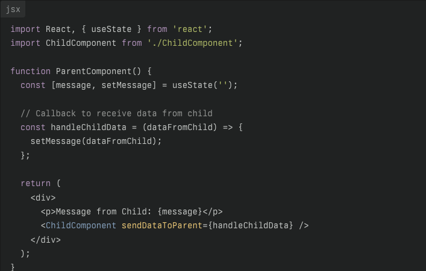
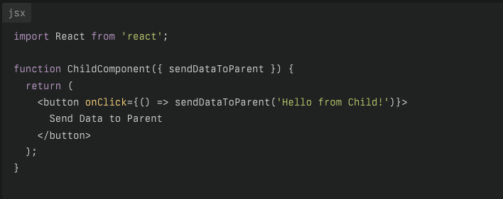
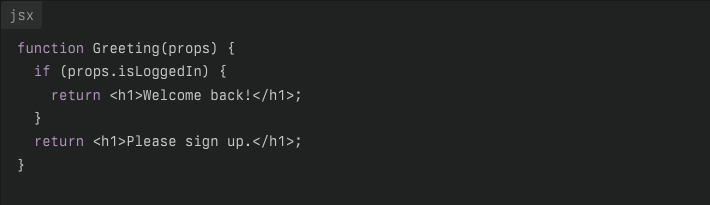
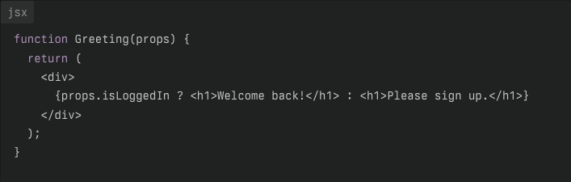
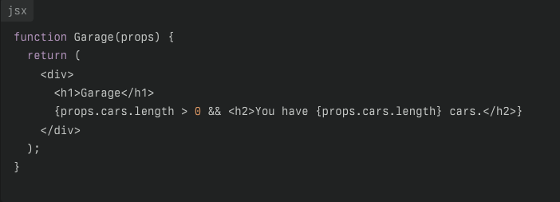
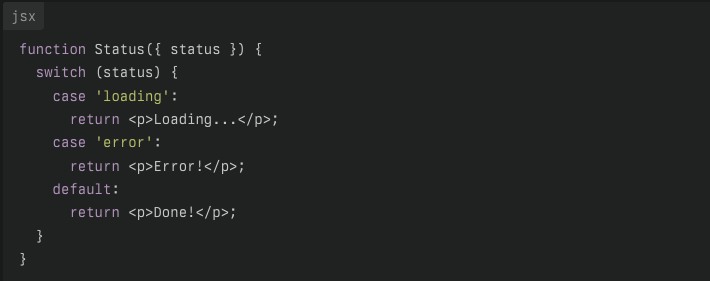
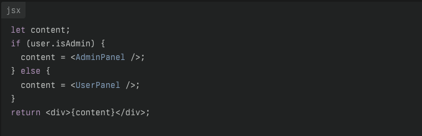
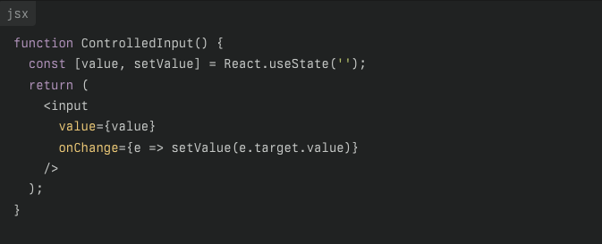
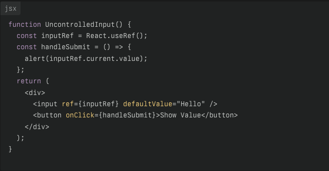

---
# 📘 ReactJS Interview Questions & Answers

This repo is my personal collection of ReactJS interview Q&A.  
Each question is answered briefly and clearly to help with interview prep and revision.
---

### Table of Contents

---
| No. | Question                                                                           |
| --- | ---------------------------------------------------------------------------------- |
| 1   | [What is React?](#what-is-react)                                                   |
| 2   | [What is Single Page Application (SPA)?](#what-is-single-page-application-spa)     |
| 3   | [What are features of React?](#what-are-features-of-react)                         |
| 4   | [What is DOM (Document Object Model)](#what-is-dom-document-object-model)          |
| 5   | [What is Virtual DOM?](#what-is-virtual-dom)                                       |
| 6   | [What are React Components?](#what-are-react-components)                           |
| 7   | [What is npm?](#what-is-npm)                                                       |
| 8   | [What is role of node_modules folder?](#what-is-role-of-node_modules-folder)       |
| 9   | [What is babel?](#what-is-babel)                                                   |
| 10  | [What is role of public folder in React app?](#what-is-role-of-public-folder-in-react-app)        |
| 11  | [What is role of src folder in React app?](#what-is-role-of-src-folder-in-react-app)              |
| 12  | [What is role of index.html page in React app?](#what-is-role-of-index.html-page-in-react-app)    |
| 13  | [What is role of App.js in React App?](#what-is-role-of-app.js-in-react-app)                      |
| 14  | [How to create Components in React?](#how-to-create-components-in-react)    |
| 15  | [When to use Function & Class Components?](#when-to-use-function--class-component)    |
| 16  | [What is state & props in React?](#what-is-state--props-in-react)                                  |
| 17  | [How is Data sent from Child Component to Parent Component? What is Lifting State Up or Callback Props?](#how-is-data-sent-from-child-component-to-parent-component-what-is-lifting-state-up-or-callback-props)    |
| 18  | [What is Conditional rendering in JSX?](#what-is-conditional-rendering-in-jsx)                     |
| 19  | [What are Controlled & Uncontrolled Components?](#what-are-controlled--uncontrolled-components)    |
| 20  | [What is Conditional rendering in JSX?](#what-is-conditional-rendering-in-jsx)                     |
| 21  | [What is Prop Drilling?](#what-is-prop-drilling)                                                   |
| 22  | [What is React Composition?](#what-is-react-composition)                                        |
| 23  | [What dependencies are essential for creating a React app?](#what-dependencies-are-essential-for-creating-a-react-app)                                        |
| 24  | [What is Bundle?](#what-is-bundle)                                                                              |
| 25  | [What is Webpack?](#what-is-webpack)                                                           |
| 26  | [What are Class Components in React? What are different ways to define them?](#what-are-class-components-in-react-what-are-different-ways-to-define-them)                               |
| 27 | [ What is difference between Class & Functional Component?](#what-is-difference-between-class--functional-component) |
| 28 | [What is difference between Inheritance & Composition in React?](#what-is-difference-between-inheritance--composition-in-react)                                                          |
| 29 | [What is constructor & super keywords in React?](#what-is-constructor--super-keywords-in-react) |
| 30 | [What is role of 'this' keyword in React?](#what-is-role-of-this-keyword-in-react) |
| 31 | [What are different types of Render in React?](#what-are-different-types-of-render-in-react) |
| 32 | [What types of rendering output does React Components support?](#what-types-of-rendering-output-does-react-components-support) |
| 33 | [How rendering happens when a React Component is created?](#how-rendering-happens-when-a-react-component-is-created) |
| 34 | [What are side effects in React?](#what-are-side-effects-in-react) |
| 35 | [What are Component Life Cycle Methods in React?](#what-are-component-life-cycle-methods-in-react) |
| 36 | [What are Hooks in React?](#what-are-hooks-in-react) |
| 37 | [What is Strict mode in React?](#what-is-strict-mode-in-react) |
| 38 | [What is Code Splitting in React?](#what-is-code-splitting-in-react) |
| 39 | [How to manage Cons of Code Splitting?](#how-to-manage-cons-of-code-splitting) |
| 40 | [What are Higher Order Components(HOCs) in React?](#what-are-higher-order-components-hocs-in-react) |
| 41 | [What is the React API?](#what-is-the-react-api) |
| 42 | [What are Design Patterns in React & Javascript?](#what-are-design-patterns-in-react--javascript) |
| 43 | [How can Hooks be used instead of HOCs in modern React?](#how-can-hooks-be-used-instead-of-hocs-in-modern-react) |
| 44 | [What are ways to style React components?](#what-are-ways-to-style-react-components) |
| 45 | [What is difference between React & React native?](#what-is-difference-between-react--react-native) |
| 46 | [What is GraphQl?](#what-is-graphql) |
| 47 | [What is React Profiler?](#what-is-react-profiler) |
| 48 | [What is React API Calls?](#what-is-react-api-calls) |
| 49 | [What are ways & tools to Optimise React app?](#what-are-ways--tools-to-optimise-react-app) |
<!-- | 45 | [What are Hooks in React?](#what-are-hooks-in-react) |
| 45 | [What are Hooks in React?](#what-are-hooks-in-react) | -->

<!-- fetch, axios diiefrence -->
<!-- React Router -->
<!-- Redux -->
-----

1. ### What is React?

   React is an _open source_ _js library_, developed by facebook(meta). It is used to build _UI interfaces_ & simplifies creation of _SPA(Single Page Applications)_, using _reusable components_ & _dynamic rendering_. It follows _Component based architecture_.

   **[⬆ Back to Top](#table-of-contents)**

2. ### What is Single Page Application (SPA)?

   Single Page Application has only one web page. Whenever data is updated by user, it gets _dynamically rendered_ on page without a _full reload_. <br/> Note: Multiple SPAs are SPAs only. eg. react app only has one single HTML file (index.html), whereas multipage apps have multiple HTML files.  <br/> eg: When a page is switched via Navbar section on an app developed by react, page changes without reloading the page. here, `<Link>` doesnt reloads page while `<a>` does.

   **[⬆ Back to Top](#table-of-contents)**

3. ### What are features of React?
   They are:    
      1. **High Performance**: React uses Virtual Dom which ensures only part of webpage where data changes gets updated instead of entire page, leading to faster & smoother app. <br/> 
      2. **One way Data Binding**: Data flow in React is unidirectional, it flows from Parent to Child. This makes app predictable & easy to debug. <br/> 
      3. **JSX (js XML)**: React used js syntax extension which makes code HTML like, thus writing HTML in js, making code more UI friendly & readable. JSX evaluates everything between `{}`<br/> 
      4. **Component Based Architecture**: React uses reusable, independent components for rendering UI & logic, making code resuable & modular. <br/> 
      5. **Server Side Rendering Support**: react supports server-side rendering components thus improving performance & SEO optimisation for the web apps. <br/> 
      6. **Dedicated Developer Tools**: Chrome has specialised Developer Tools which help in simplifying debugging & performance monitoring.

   **[⬆ Back to Top](#table-of-contents)**

4. ### What is DOM (Document Object Model)?
    DOM is a *browser* feature. It is a *tree like* representation of a web page. It *allows js* to dynamically access elements, thus allowing dynamic creation & updation of webpage contents & its structure. <br/> **DOM Updation** converts static webpage into dynamic ones.

5. ### What is Virtual DOM? **

   Virtual DOM is a *core concept of react* & other *modern Js frameworks*. It is *lightweight representation* of real DOM, created *in memory* used by *Browsers* to *render dynamic web pages*. <br/> **How it works?** <br/> 1. **Representation** : V-DOM is a *js object* which mirrors structure of *real DOM*, is faster to create & update as it lacks overheads of **Real Browser Rendering**<br/> 2. **Change Detection** : Whenever a *component's state or prop changes* in React, a *new V-DOM* is created to *represent updated UI*.<br/> 3. **Diffing** : React compares the new V-Dom with previous V-DOM to find out what has been changed using *Diffing algorithm or Reconcilliation*. Basically it identifies changes between these two trees. <br/> 4. **Efficient Updates** : Only *changed parts* of web page are updated in real DOM by React (during the commit phase) instead of re-rendering entire page which is slower & resource intensive. <br/> 5. **Batching** : Updates to real Dom are batched together to improve performance, & reduce recalculation & repaints.<br/> <br/> 
   > Overheads of Real Browser Rendering are - frequent DOM Manipulation, Large DOM Size, Complex CSS Selectors, Js DOM access, initial render updates, Layoutthrashing etc.
   React's Diffing Algo has Complexity -  O(n) both Time & space where n - no. of elements in tree.

   **[⬆ Back to Top](#table-of-contents)**

6. ### What are React Components?

   React Components are reusable building blocks for creating UI.

7. ### What is npm?

   npm - *node package manager* is standard package manager for NodeJs. It is used to *install, manage & share* **Js packages & dependencies** for NodeJs project. <br/> In react, npm does Project initialisation, Running & Building Apps, Dependencies Management, Script Execution (define & run custom scripts), Efficient Package Installation, Version Control (package.json), & Collaboration & Code Sharing.  

   **[⬆ Back to Top](#table-of-contents)**

8. ###  What is role of node_modules folder?

   node_modules folder is a directory *automatically created* at root of your project when you *install packages* using npm. It is *storage location* of all *external dependencies* required by your project.

9. ### What is babel?

   Babel is a free & open source Js compiler which converts *new, modern Js code (ECMA Script 2015/ES6 & newer)* into *older* compatible versions, so that they can run in older browsers or Js engines. This allows developers to use latest language features without worrying about *browser compatibility*. It can transpile modern Js as well as supports Typescript & JSX too.<br/> In react, since browser cant directly read JSX file, babel transpiles JSX code into Js. <br/> 
   ```js
   function App(){ 
     return React.createElement(
     'div', 
      {className: 'app'}, 
      React.createElement('h1',null,"Hello"), 
    )}
    ```
    > Transpiler converts source code from one programming language to another.

    **[⬆ Back to Top](#table-of-contents)**

10. ### What is role of public folder in React app?

    It contains all *static assets needed by Browser* & not processed by build tools like **Webpack**.  They are directly accessed by URL, & not processed by build system.

11. ### What is role of src folder in React app?

    It is most important folder in development. It contains all source code & logic of application. It defines structure, behaviour, styling of the app. Only files inside /src are processed by build tools like Webpack.

12. ### What is role of index.html page in React App?

    It is *entry point* of React app. It is the *first page to be loaded* by browser for SPAs. It contains 'root' id element wherein entire React app will be rendered directly.

13. ### What is role of App.js in React App?

    It is present inside /src in React app, & is root of main app's component tree.

14. ###  How to create Components in React?

      Components are the *building blocks* of *creating User Interfaces(UI)* in React. There are two ways: <br/> <ol> <li> **Function Component**: This is the simplest way to create a component. Those are *pure JavaScript functions* that accept *props object* as the only parameter and *return React elements (in JSX Format)* to *render the output*: <br/> 
      `function Greeting({ message }) {` <br/> `return <h1>{"Hello, ${message}"}</h1>;`<br/> `}` <br/><br/> <li> **Class Component**: ES6 class can be used to define a component. <br/>
       `class Greeting extends React.Component {`<br/>
       `render() {` <br/> 
         `return <h1>{`Hello, ${this.props.message}`}</h1>;`<br/>
         `}`<br/>
       `}`<br/></ol>

       **[⬆ Back to Top](#table-of-contents)**

15. ### When to use Function & Class Components?

      After addition of Hooks (React v.16.8 onwards) it is recommended to use **Function Components** over **Class** ones, as now with Function C, features which were only available in Class C. like state, lifecycle methods are available here too.<br/> So, use Class Components where a Function Component equivalent is not present yet (like Err Boundaries) or while working in older versions where state or lifecycle methods are needed. <br/> Use Functional C. mostly as they are simple, readable & follow modern code practices like, use of React Hooks for state & side effects.

      **[⬆ Back to Top](#table-of-contents)**

16. ###  What is state & props in React?

      **State** is a *built-in object* in React components, used to *store data or information of component* which can change over time. They are *mutable*, in reponse to user actions, API responses or other events. It is used for data which needs to be *tracked or updated* within a component. <br/>
      
      ```js 
      function Counter() {
     const [count, setCount] = React.useState(0);
      return (
       <div>
         <p>{count}</p>
         <button onClick={() => setCount(prevCount => prevCount + 1)}>Increment</button>
         //This ensures you always get the latest state value, even if multiple updates are batched together.
       </div>);
      } 
      ``` 
      > When state changes, React automatically re-renders the component (& all its child Components) to reflect the new state.
      Event Handler Functions expects a callbackFn for setterFn.

      **Props** are inputs to a React component, passed from a parent component to a child component. They are **immutable** within the receiving component. They are used to **pass data and event handlers** down the component tree, thus making it *dynamic and reusable*. 
      > Note: props are objects which can be *Destructured*. To forward all props, use Spread operator `{...props}`  
      
      ```js 
     function Welcome(props) {
      return <h1>Hello, {props.name}!</h1>;
      }
      // Usage: <Welcome name="Alice" />
      ```
 
      **[⬆ Back to Top](#table-of-contents)**

17. ### How is Data sent from Child Component to Parent Component? What is Lifting State Up or Callback Props?

      Standard Approach is: <br/> <ol> <li> The parent component defines a *callback function*. <li>The parent *passes* this function to the child component *via props*. <li>The child component *calls this function*, *passing the data as an argument*. <li>The parent *receives the data* and *can update its state* or perform other actions. </ol> <br/> Note: This pattern is called **lifting state up** or **callback props**. <br/> <br/> **Parent Component** <br/><br/>   <br/><br/>  **Child Component** <br/><br/>   <br/> Note: This maintains unidirectional flow of data.

      **[⬆ Back to Top](#table-of-contents)**

18. ### What is Conditional rendering in JSX?

    It is similiar to syntax in Js but with some changes: <ol><li>**If Statement**: <br/>  <li>**Ternary Operator**: <br/>  <li>**Logical && Operator**: First part of statement has to be true to render second part.<br/>   <li>**Switch Statement**: <br/>  <li>**Element Variables**: <br/> </ol>  

19. ### What are Controlled & Uncontrolled Components? **

      In React, the main difference lies in how the values of components are managed.<br/> <ol><li>**Controlled Components**: These are React Components where *value* is managed by *state*. React state is *single source of truth* for input's value. e.g.: input in form element.<br/> Here, component recieves *value* & an *Event Handler* as *prop*, which gets trigerred by user action,which may update state & UI will reflect latest state.<br/>React has full control over data, components are predicatable, easy to validate, & it enables real time data sharing between components. <br/> It can cause more re-renders, especially with many inputs or frequent updates. <br/>  <br/>  <br/> <br/>                       <li> **Uncontrolled Components**: Here, React does not directly control the input's value. These manage its own state internally, with the DOM maintaining the current value. <br/> Here, the input's value can be accessed directly from the DOM, typically using a *ref*. It uses *defaultValue* to set the *initial value of an input field* when the component is *first rendered*. Any further changes are tracked by **DOM** & not by **React**. It has no involvement of React state.<br/>   <br/>    </ol> 
      > This needs fewer re-renders for high frequency inputs. But, it is harder to validate & synchronize with other components. It is also less predictable & state can be changed outside React's knowledge.

      **[⬆ Back to Top](#table-of-contents)**

20. ### What is State, Stateful, Stateless terms?

      **StateFul Component**: It manages its own state. This means it *holds data* that can *change over time* and *affect the component’s output*. When the *state changes (using setState in class components* or *hooks like useState in functional components)*, the *component re-renders* to reflect the new state.

      **Stateless Component**: It is called a "presentational" component, *does not manage its own state*. It *receives all necessary data via props* and renders output based solely on those props. Stateless components are *easier to test and reuse*, as they do not have internal state dependencies.

      Some types of States are:
      1. Local State: Managed within a single component using useState or this.setState.
      2. Shared/Global State: Shared between multiple components, managed via Context API or state management libraries like Redux, MobX, or Recoil.
      3. UI State: Controls UI-specific data (e.g., modal visibility, input values). 
      4. Fetch State: Manages data from asynchronous operations like API calls.<br/> <br/>

      > States are modified using updater functions. If new value is relevant to prev Value, It must be modified using prevState to yield up to date values as state updates are usually batched & asynchronous.
      ```js
      setState(prevState => ({
       ...prevState,
      userName: newValue
      }));
      setCount(prev=> prev+1);
      ```

      **[⬆ Back to Top](#table-of-contents)**

21. ### What is Prop Drilling?

      Prop drilling in React is the process of *passing data (props)* from a parent component down through multiple layers of nested components *until it reaches* the component that actually needs it. It means intermediary components *receive and forward props* even if they don't use them themselves.
      It is an issue because it leads to *Code Duplication*, Difficulty in tracking components, props & decreased Maintainability.
      It can be avoided using Global/Shared States.

      **[⬆ Back to Top](#table-of-contents)**

22. ### What is React Composition?

      It is a core concept that involves building complex user interfaces by combining smaller, reusable components together.<br/>
      This pattern promotes code reusability, maintainability, and scalability, as each component is responsible for a specific piece of functionality.<br/> 
      **Composition is favored over inheritance** in React for *code reuse and flexibility*.<br/>
      How is it done?
      1. Children prop: Components can recieve other Components as their Children. It is used when Parent doesnt know what will render inside.
         ```js
         const Card = ({ children }) => <div className="card">{children}</div>;

         // Usage
         <Card>
            <h2>Title</h2>
            <p>Description</p>
         </Card>
         ```
      2. Passing Components as Props: You can pass entire components as props to other components, enabling dynamic rendering and customization.
      3. Compound Components: A pattern where a parent component manages state and shares it with nested child components, via Global States.
      4. Higher-Order Components (HOCs) and Render Props: Advanced composition techniques for sharing logic between components without repeating code.

      **[⬆ Back to Top](#table-of-contents)**

23. ### What dependencies are essential for creating a React app?

      1. Node.js & npm/yarn: Node.js is the JavaScript runtime needed to run development tools, while npm or yarn are package managers for installing dependencies.
      2. React & ReactDOM: The core libraries for building user interfaces (react) and rendering them to the DOM (react-dom).
      3. Babel: A JavaScript compiler that transforms modern JavaScript (including JSX) into browser-compatible code.
      4. Webpack: A module bundler that compiles JavaScript, CSS, images, and other assets into optimized bundles for the browser (explained in detail below).
      5. Create React App (CRA): A popular tool that sets up a React project with sensible defaults, including Webpack and Babel configurations. Other ways of creating react app is by using Vite.
      6. Development Tools: Tools like ESLint (for code linting), React Developer Tools (for debugging), and testing libraries (e.g., Jest, React Testing Library).

      **[⬆ Back to Top](#table-of-contents)**

24. ### What is Bundle?

      A bundle is the output file (or files) **generated by Webpack** or similar bundlers. It contains all the code and assets your application needs, **combined and optimized** for the browser. <br/>
      Role: The bundle ensures that the browser can **load your React app quickly and efficiently**, with all dependencies resolved.

      **[⬆ Back to Top](#table-of-contents)**

25. ### What is Webpack?

      Webpack is a powerful traditional **module bundler** for JavaScript applications. Its primary role is to:
      1. **Bundle all your JavaScript files and dependencies** (including CSS, images, fonts, etc.) into one or more optimized files for the browser.
      2. **Transform code** using **loaders** (e.g., converting JSX to JS with Babel).
      3. **Optimize assets for production**, such as minifying code and splitting bundles for faster loading.<br/><br/>
      Webpack **automates** the process of managing dependencies and assets, ensuring your React app runs efficiently in development and production environments.<br/>
      **During Development**, Webpack uses features like **Hot Module Replacement (HMR)**, allowing you to see changes instantly without a full page reload.<br/>
      **For Production**, It produces optimised bundles, reduce load times, improve performance By minifing code, removing unused code (tree shaking), splitting code( for faster initial loads).<br/><br/>
      It is **not available in Vite**. Vite has **Rollup** instead for production buildup & very fast HMR using **native ES modules** for Development phase.

      **[⬆ Back to Top](#table-of-contents)**

26. ### What are Class Components in React? What are different ways to define them?

      **Class components** are one of the main ways to define components in React (the other being function components). Before React v16.8 and the *introduction of Hooks*, class components were the primary way to *manage state* and use *lifecycle methods* in React apps.

      A class component
      1. Is a **JavaScript class*** that *extends React.Component* (or Component if imported directly).
      2. Must include a *render() method*, which **returns the JSX** to display.
      3. Can **manage its own state** and *respond to lifecycle events* like *mounting, updating, and unmounting*.
      
      **Defining Class Component:**
      ```js
      //ES6 Class Syntax
      class Car extends React.Component {
            render() {
              return <h2>Hi, I am a Car!</h2>;
            }
      }
      //Usage: <Car/>

      //Directly importing Component
      import { Component } from 'react';
      class Greeting extends Component {
         render() {
            return <h1>Hello, {this.props.name}!</h1>;
         }
      }

      // With a Constructor (for State or Binding)
      // if state or bind methods are to be used
      class Car extends React.Component {
         constructor(props) {
            super(props);
            this.state = { color: "red" };
         }
      render() {
         return <h2>I am a {this.state.color} Car!</h2>;
            }
      }

      // With Static Properties: features like context
      class Button extends React.Component {
         static contextType = ThemeContext;
            render() {
            const theme = this.context;
            return <button className={'button-' + theme}>{this.props.children}</button>;
            }
      }
      ```
      >React.Component is a parent class featured by React lib & class ("Car") inherits its features.
      `static` means `contextType` is a property that `belongs to the class itself`, not to instances of the class.

      **[⬆ Back to Top](#table-of-contents)**

27. #### What is difference between Class & Functional Component?

      | Aspect                | Class Component                                           | Functional Component                                         |
      |-----------------------|----------------------------------------------------------|--------------------------------------------------------------|
      | **Definition** **        | Uses ES6 class syntax, extends `React.Component`         | Plain JavaScript function that accept props as arguments & returns JSX                   |
      | **Syntax**            | More verbose, requires `render()` method                 | Simpler, less boilerplate                                    |
      | **State Management**  | Uses `this.state` and `this.setState`                    | Uses React Hooks (e.g., `useState`) for state                |
      | **Lifecycle Methods** | Has built-in lifecycle methods (e.g., `componentDidMount`) | Uses `useEffect` hook to handle lifecycle events             |
      | **`this` Keyword**    | Must use `this` to access props, state, methods          | No need for `this`                                           |
      | **Performance**       | Slightly less efficient due to more overhead             | Generally more efficient and lightweight                     |
      | **Best Use Case**     | Legacy codebases, Error Boundaries, complex lifecycle    | Modern React apps, most use cases                            |
      | **Composition**       | Supports inheritance                                     | Encourages composition (preferred in modern React)           |

      **[⬆ Back to Top](#table-of-contents)**

28. ### What is difference between Inheritance & Composition in React?

      **Composition** and **inheritance** are two *approaches* for **structuring and reusing code**, but React strongly favors composition for building user interfaces.

      **Composition** is the practice of building complex UIs by combining smaller, reusable components. Components are nested, and data or behavior is shared via props and children.  

      **Inheritance**: It is when one class component extends another, *inheriting its properties and methods*—an approach borrowed from object-oriented programming. It creates a base component & extend it for specialized components.
      ```js
      class Button extends React.Component { /* ... */ }
      class SubmitButton extends Button { /* ... */ }
      ```
      > It leads to **tightly coupled, hard-to-maintain code** which is **less flexible** for UI composition and code reuse.
      Better Alternatives are **composition, HOCs, render props**.

      **[⬆ Back to Top](#table-of-contents)**

29. ### What is constructor & super keywords in React?

      **constructor**: It is a special *method in JavaScript classes* that is called when a new instance of the class is created. It is used to *initialize the object’s properties*. 
      ```js
      class Car {
            constructor(brand) {
            this.brand = brand;
            }
      }
      ```

      **super**: It is used in a *subclass (a class that extends another class)* to call the constructor of its parent class. 
      `super()` is to be called in the **constructor of a derived class** before using `this`.<br/>This ensures the **parent’s properties and methods** are initialized before the child adds its own.<br/> 
      `super` can also be used to call methods from the parent class inside child class methods.
      ```js
      class Vehicle {
      constructor(type) {
            this.type = type;
      }
      }

      class Car extends Vehicle {
      constructor(type, brand) {
            super(type); // Calls the parent (Vehicle) constructor
            this.brand = brand;
        }
      }
      ```   
      **[⬆ Back to Top](#table-of-contents)**  

30. ### What is role of 'this' keyword in React? **

      In React, the `this` keyword is used to refer to the *current instance* of a **component class**. It allows you to *access the component's props, state, event handlers and methods* within its class definition. <br/> e.g. using `this.state`(to get or set C.'s state),<br/> `this.props`(accessing properties passed from parent C.), <br/> `this.handleClick`(passing as *callback functions*) or <br/> `this.methodName()`(call other methods in same class) inside Class Component.<br/>
      > C - Component

      While passing class methods as **event handlers**  (e.g., onClick={this.handleClick}), it must be ensured that `this` refers to the **correct component instance**. Otherwise, this may be *undefined* or refer to the *global object*, leading to errors (Losing `this` Context).
      1. It can be fixed by **binding the method** in constructor

            ```js
            constructor(props) {
            super(props);
            this.handleClick = this.handleClick.bind(this);
            }
            ```
      2. Also. **Arrow functions** automatically bind this to the class instance.

            ```js
            class Counter extends Component {
            constructor(props) {
                  super(props);
                  this.state = { count: 0 };
            }

            // Arrow function ensures 'this' refers to the component instance
            increment = () => {
              this.setState({ count: this.state.count + 1 });
            };

            render() {
              return (
                  <div>
                     <p>Count: {this.state.count}</p>
                     <button onClick={this.increment}>Increment</button>
                  </div>
                  );
                }
            }
            ```

      In **Functional Components**:
      1. In React functional components, `this` is not used. State and props are accessed directly via **hooks** and **function parameters**, not through this.<br/>

      2. If you use `this` in a functional component, it refers to the **global object (or is undefined in strict mode)**, not the component instance.
       > An instance is a specific, live version of your class component, created and managed by React, with its own state and behavior. **Arrow functions** help make sure that when you use this inside your component methods, it always refers to the correct instance.

       **[⬆ Back to Top](#table-of-contents)**

31. ### What are different types of Render in React?

      1. Client-Side Rendering (CSR): The most common approach, where React renders components in the browser using JavaScript. The initial HTML is minimal, and the full UI is built and updated on the client side.
      2. Server-Side Rendering (SSR): React components are rendered on the server, and the resulting HTML is sent to the client. This improves SEO and initial load performance because the user receives a fully rendered page from the start.
      3. **Static Site Generation (SSG)**: The React app is *pre-rendered* into static HTML at build time. This approach is used for content that doesn’t change often and offers excellent performance.
      4. **Component Re-rendering**: Whenever state or props change, React may re-render only the affected components, not the whole app. This is optimized using techniques like **shouldComponentUpdate()** and the **virtual DOM** diffing algorithm.

      **[⬆ Back to Top](#table-of-contents)**

32. ###  What types of rendering output does React Components support?

      1. React elements (JSX).
      2. Arrays or fragments (multiple elements).
      3. Portals (rendering into a different DOM subtree).
      4. Strings, numbers (as text nodes).
      4. Null/undefined/booleans (render nothing).

      **[⬆ Back to Top](#table-of-contents)**

33. ### How rendering happens when a React Component is created?

      1. Triggers a Render:
            a. **Initial Render**: When your app starts, you call createRoot and then root.render(<App />) (or similar). This triggers the first render of your root component.
            ```js
              import { createRoot } from 'react-dom/client';
              import App from './App';

              const root = createRoot(document.getElementById('root'));
              root.render(<App />);
            ```

            b. **re-render**: Any update to state or props triggers a re-render of the affected component and its descendants.<br/>
      2. Rendering the Component:
            a. React calls your component function (for function components) or the render() method (for class components) to determine what UI should be displayed.

            ```js
            function App(){
                  return <h1>Hello</h1>
            }
            ```

            b. If your component returns other components, React recursively renders those as well, building a tree of UI elements.
      3. Virtual DOM Diffing: 
            a. React creates a virtual DOM representation of the UI and compares it to the previous version to determine what has changed. Only the minimal necessary changes are identified for updating the actual DOM (the reconciliation process).
      4. Committing to the DOM. 
            React applies the calculated changes to the real DOM in a process called the "commit phase".
            This is when the user actually sees updates on the screen.
      5. Component Lifecycle and Side Effects: 
            After the DOM update, React may run lifecycle methods or effects (like componentDidMount, useEffect, etc.), allowing you to perform side effects such as data fetching or subscriptions.

      **[⬆ Back to Top](#table-of-contents)**      

34. ### What are side effects in React?

      The primary responsibility of a React component is to *render the UI* based on its current state and props. This means:
      1. Receiving inputs (props, state).
      2. Returning what should be displayed (JSX or React elements). 
      3. Not causing changes to the outside world during rendering. 
      
      <br/> **Side effects** are anything that goes beyond this core responsibility. e.g. Fetching data from an API (getting information from a server), Setting up a timer or interval (like updating a clock), Manually changing the DOM (for example, focusing an input), Subscribing or unsubscribing to events (like listening for window resize), Logging data to the console. <br/> <br/> **Fetching data** is a side effect because: 
      1. It communicates with a server (outside React). 
      2. It may cause changes elsewhere (network traffic, server logs). 
      3. It’s asynchronous and can’t be completed during the synchronous render process. <br/>
      > If data fetching was done directly inside the render function, it would break the predictable, pure nature of rendering and could lead to bugs or performance issues.
      Also, In case of Side Effects, React first renders the component and updates the DOM.
      After the render is complete, React runs the **side effects** (managed via useEffect). 

      **[⬆ Back to Top](#table-of-contents)**


35. ### What are Component Life Cycle Methods in React?

      React components have a **"lifecycle"** (a series of stages from creation to removal) that you can tap into using special methods called **lifecycle methods**. These are most relevant for **Class-based Components**, as **functional components use hooks** for similar behavior. <br/> React mostly has 3 methods:
      1. **Mounting**: Component is **created** and **inserted** into the DOM.
      2. **Updating**: Component is **re-rendered** due to changes in props or state.
      3. **Unmounting**: Component is removed from the DOM.

      1. **Mounting Methods**: These methods are called when a component is being inserted into the DOM:

            1. **constructor(props)**: Initializes state and binds methods. Not strictly required unless you need to set up state or bindings.

            2. static **getDerivedStateFromProps(props, state)**: Rarely used, allows state updates based on props before rendering.

            3. **render()**: The only required method; returns the JSX to render.

            4. **componentDidMount()**: Runs after the component is mounted. Used for side effects like data fetching or subscriptions.<br/>

            > The initial render in React occurs during the Mounting phase of the component lifecycle.
            When a component is first created and inserted into the DOM, React triggers the **initial render** by calling the component’s **render() method**, which determines what should appear on the screen. 
            This process happens after any initialization (like setting up state in the constructor) and before the component is fully mounted and componentDidMount() is called. So, sequence is **Initialization** (e.g., constructor runs)--> **Mounting** (initial render occurs here, using render()) --> **componentDidMount** (runs after the initial render and DOM insertion)

      2. **Updating Methods**: Called whenever the component is re-rendered due to state or prop changes:

            1. static **getDerivedStateFromProps(props, state)**: Also called during updates.

            2. **shouldComponentUpdate(nextProps, nextState)**: Lets you optimize performance by preventing unnecessary renders.

            3. **render()**: Called again to update the UI.

            4. **getSnapshotBeforeUpdate(prevProps, prevState)**: Lets you capture information (like scroll position) before the DOM is updated.

            5. **componentDidUpdate(prevProps, prevState, snapshot)**: Runs after updates are flushed to the DOM, good for side effects that depend on the DOM.

      3. **Unmounting Method**: Called just before the component is removed from the DOM:

            **componentWillUnmount()**: Used for cleanup, such as cancelling timers or unsubscribing from services.<br/><br/> 

      **Functional Components**: Hooks:
      After React 16.8v, lifecycle features can be accessed using specific hooks, `useEffect`. <br/>

      1. It is the primary hook for *handling side effects* and *lifecycle events* in functional components.
      2. It can mimic all three main lifecycle methods from class components:
            1. **componentDidMount**: Run code once after the component mounts by providing an empty dependency array ([]) to useEffect.
            2. **componentDidUpdate**: Run code after state or props update by specifying dependencies ([dependencies]) in the array. 
            3. **componentWillUnmount**: Cleanup logic (like removing event listeners or cancelling timers) by returning a function from useEffect.
                  ```js
                  import { useEffect } from 'react';

                  function Example() {
                      useEffect(() => {
                  // Code to run on mount

                  return () => {
                        // Cleanup code runs on unmount
                        };
                  }, []); // Empty array = run once on mount
                  }
                  ```
      **useState**
      Used for *managing local state* within *functional components*, replacing *this.state* and *this.setState* from *class components*.
      > Custom hooks that start with use & can encapsulate & reuse stateful logic or side effects across multiple components.

      **[⬆ Back to Top](#table-of-contents)**

36. ### What are Hooks in React?

      React provides a set of *built-in hooks* that allow functional components to *access features* like **state, context, refs, side effects, and performance optimizations** without needing class components.
      
      1. **State Hooks**: <br/>
            a. **useState**: Adds local state to functional components.           
            ```js
            import React, { useState } from "react";

            function Counter() {
              const [count, setCount] = useState(0);
              return (
                <button onClick={() => setCount(prev => prev + 1)}>
                  Count: {count}
                </button>
              );
            }
            ```
            b. **useReducer**: Manages more complex state logic using a reducer function, similar to Redux.

            ```js
            import React, { useReducer } from "react";

            function reducer(state, action) {
              switch (action.type) {
                case "increment":
                  return { count: state.count + 1 };
                default:
                  return state;
              }
            }

            function Counter() {
              const [state, dispatch] = useReducer(reducer, { count: 0 });
              return (
                <button onClick={() => dispatch({ type: "increment" })}>
                  Count: {state.count}
                </button>
              );  
            }
            ```
      
      2. **Context Hooks**:
            **useContext**: Accesses values from React’s context API, allowing components to consume context values without prop drilling. Used for Deeply nested Components.
            
            ```js
            import React, { useContext } from "react";

            const ThemeContext = React.createContext("light");    //returns object

            function ThemedButton() {
              const theme = useContext(ThemeContext);
              return <button style={{ background: theme === "dark" ? "#333" : "#fff" }}>Theme: {theme}</button>;
            }            
            ```

      3. **Ref Hooks**:
            a. **useRef**: Creates a mutable object that persists for the lifetime of the component, often used to reference DOM elements or store values that don’t trigger re-renders. 
            > Such Components are called Uncontrolled C.
            ```js
            import React, { useRef } from "react";

            function FocusInput() {
              const inputRef = useRef();

              return (
                <>
                  <input ref={inputRef} />
                  <button onClick={() => inputRef.current.focus()}>Focus Input</button>
                </>
              );
            }
            ```

            b. **useImperativeHandle**: Customizes the instance value that is exposed when using ref with forwardRef.
            ```js
            import React, { useRef, forwardRef, useImperativeHandle } from "react";

            const FancyInput = forwardRef((props, ref) => {
              const inputRef = useRef();
              useImperativeHandle(ref, () => ({
                focus: () => inputRef.current.focus()
              }));
              return <input ref={inputRef} />;
            });

            function Parent() {
              const ref = useRef();
              return (
               <>
                  <FancyInput ref={ref} />
                  <button onClick={() => ref.current.focus()}>Focus Fancy Input</button>
                </>
              );
            }
            ```

      4. **Effect Hooks**:
            a. **useEffect**: Performs side effects in components, such as data fetching, subscriptions, or manually changing the DOM. Runs after the render is committed to the screen.
            > `useEffect(callbackFn, dependencyArray)`
               callbackFn: runs when useEffect is called
               dependencyArray: optional, triggers useEffect(). With change in dependencies, callbackFn runs.
               Refer Q.35(1)(4), Q.35(2), Q.35(3).

            ```js
            import React, { useState, useEffect } from "react";

            function Timer() {
              const [seconds, setSeconds] = useState(0);

              useEffect(() => {
                const interval = setInterval(() => setSeconds(s => s + 1), 1000);
                return () => clearInterval(interval); // Cleanup
              }, []);

              return <div>Seconds: {seconds}</div>;
            }
            ```

            b. **useLayoutEffect**: Similar to useEffect, but fires synchronously after all DOM mutations. Useful for reading layout and synchronously re-rendering.
            ```js
            import React, { useLayoutEffect, useRef } from "react";

            function LayoutExample() {
              const divRef = useRef();

              useLayoutEffect(() => {
                divRef.current.style.background = "yellow";
              }, []);

              return <div ref={divRef}>This div turns yellow on mount!</div>;
            }
            ```

      5. **Performance Hooks**: ** <br/>
            a. **useMemo**: Memoizes expensive calculations, only recomputing when dependencies change, to optimize performance..
            ```js
            import React, { useState, useMemo } from "react";

            function ExpensiveCalculation({ num }) {
              const result = useMemo(() => {
                let sum = 0;
                for (let i = 0; i < 1000000; i++) sum += num;
                return sum;
              }, [num]);
              return <div>Result: {result}</div>;
            }
            ```
            b. **useCallback**: Memoizes callback functions so they aren’t recreated on every render, helping to prevent unnecessary re-renders of child components.
            ```js
            import React, { useState, useCallback } from "react";

            function Button({ onClick }) {
              return <button onClick={onClick}>Click me</button>;
            }

            function Parent() {
              const [count, setCount] = useState(0);
              const handleClick = useCallback(() => setCount(c => c + 1), []);
              return (
                <>
                  <Button onClick={handleClick} />
                  <div>Count: {count}</div>
                </>
              );
            }
            ```

      6. Other Built-in Hooks: <br/>
            a. **useDebugValue**: Used to display a label for custom hooks in React DevTools.
            b. **useDeferredValue**, **useTransition**: For concurrent rendering and managing transitions (advanced performance optimizations).

      7. Custom Hooks: You can create your own custom hooks by combining built-in hooks to **encapsulate reusable logic**. Custom hooks are simply functions that start with `use`.<br/>

            >Hooks can only be used *inside React functional components* and must be called at the **top level of the component**, not inside loops, conditions, or nested functions.

       **[⬆ Back to Top](#table-of-contents)**

37. ### What is Strict mode in React?

      Strict Mode in React is a *development-only* tool that helps you identify potential problems in your application. It *does not render* any visible UI and has *no impact on the production build*. <br/>
            1. Done by wrapping your component tree (or part of it) in `<StrictMode>`.<br/>
            2. It checks problems like:<br/>
                  - Detecting side effects and ensuring they are properly cleaned up.<br/>
                  - Warning about usage of deprecated or unsafe lifecycle methods.<br/>
                  - Warning about legacy string ref API usage, improper use of refs.<br/>
                  - Double-invoking certain functions and effects to catch bugs caused by impure rendering or missing cleanup.<br/>
            3. Benefits:<br/>
                  - Finds common bugs early.<br/>
                  - Keeps code up-to-date.<br/>
                  - No impact on production.   <br/>
      ```js
      import { StrictMode } from 'react';
      import { createRoot } from 'react-dom/client';

      const root = createRoot(document.getElementById('root'));
      root.render(
        <StrictMode>
          <App />
        </StrictMode>
      );
      ``` 

       **[⬆ Back to Top](#table-of-contents)**              

38. ### What is Code Splitting in React?      

     It is a performance optimization technique in React, where your *application’s JavaScript code* is divided into *smaller chunks or bundles*.<br/> Instead of loading the entire app’s code at once, React loads only the necessary parts when they are needed, such as *when a user navigates to a new page or interacts with a specific feature*.

      **Advantages:**
      - **Faster Initial Load:** Only essential code is loaded up front, so the app starts faster.
      - **Reduced Bundle Size:** Non-essential code is loaded on demand, keeping the main bundle small.
      - **Improved User Experience:** Users see the UI sooner and interact with it without waiting for everything to load.
      - **Resource Optimization:** Browser memory and network usage are minimized by loading code only when needed.

      **Implementation:**
      - **Dynamic Imports:** Using the `import()` syntax to *load modules* only when required.
      - **React.lazy:** Allows you to *render a dynamic import* as a regular component, enabling lazy loading of components.
      - **Suspense:** Lets you show a fallback (like a loading spinner) while the lazy-loaded component is being fetched.
      
      ```jsx
      import React, { Suspense } from 'react';

      //OtherComponent will only be loaded when it’s actually needed, not in the initial bundle
      const OtherComponent = React.lazy(() => import('./OtherComponent'));

      function MyComponent() {
        return (
          <Suspense fallback={<div>Loading...</div>}>
            <OtherComponent /> 
          </Suspense>
        );
      }
      ```
      **Types of Code Splitting**
      - **Route-based Code Splitting:** Load code for different routes/pages only when the user navigates to them.
      - **Component-based Code Splitting:** Load large or rarely used components only when they are rendered.
      **Cons**:
      - Bundle management complexity: Harder to manage dependencies and loading order.
      - Loading delays:	Users may see loading states for code that isn't yet fetched.
      - Deployment issues: Old chunks may be unavailable after a new deployment, breaking the app.
      - CSS unpredictability:	Dynamic loading can affect CSS selector order and styling consistency, if not properly managed.
      - Limited benefit for small apps.
      > Webpack works on basis of this Code Splitting to run optimised apps.

      **[⬆ Back to Top](#table-of-contents)**

39. ### How to manage Cons of Code Splitting?
      
      There are several best practices and strategies to effectively manage the drawbacks:
      1. **Use Route-Based and Component-Based Splitting Thoughtfully**:
      - **Route-based code splitting** is often the best starting point, as it naturally divides your app into logical chunks loaded as users navigate between pages.
      - **Component-based code splitting** should be reserved for large, rarely used, or non-critical components. Avoid splitting essential UI parts (like headers or navigation) to prevent unnecessary loading delays.
      2. **Provide Fallback UI with Suspense**
      - Always wrap lazy-loaded components with `<Suspense>` and provide a clear, user-friendly fallback (like a spinner or skeleton loader) to handle loading delays gracefully.

      ```jsx
      <Suspense fallback={<div>Loading...</div>}>
        <LazyComponent />     
      </Suspense>
      ```

      3. **Use Error Boundaries**
      - Wrap lazy-loaded components in error boundaries to catch and handle loading or chunk errors, especially after deployments when old chunks might be missing.
      ```jsx
        <ErrorBoundary>
        <Suspense fallback={<div>Loading...</div>}>
        <LazyComponent />
        </Suspense>
        </ErrorBoundary>
      ```
      4. Avoid Over-Splitting:
      - Don’t split every small component; too many tiny chunks can increase HTTP requests and overhead, negating performance benefits.
      - Focus on splitting large, infrequently used, or third-party-heavy components.

      5. Manage CSS and Assets Carefully
      - When splitting components that import CSS, ensure style order and dependencies are preserved to avoid inconsistent styling.
      - Consider critical CSS inlining for above-the-fold content.

      6. Preload or Prefetch Important Chunks:
      - Use techniques like preloading or prefetching for routes or components likely to be needed soon, reducing perceived delays.
      
      7. Test Deployment and Chunk Loading
      - After deploying updates, test that all chunks load correctly and handle scenarios where users might have outdated bundles cached.
      >Above the fold content - the portion of a web page that is visible to a user immediately after the page loads, without any scrolling. 
      Below the fold = Content that appears only after the user scrolls down.
      Preloading ensures critical resources for above the fold content are loaded as soon as possible.
      `<link rel="preload" href="/main.css" as="style">`
      Prefetching prepares resources for upcoming navigation or interactions(needed in near future), improving future load times.
      `<link rel="prefetch" href="/next-page.js" as="script">`

      **[⬆ Back to Top](#table-of-contents)**

40. ### What are Higher Order Components(HOCs) in React?

     It is a function that takes a component as input and returns a *new component* with *enhanced or additional functionality*. HOCs are not a part of the official React API, but a **design pattern** that emerges from *React’s compositional nature*.
     ```js
      const withExtraProps = (WrappedComponent) => {
        return (props) => <WrappedComponent {...props} extraProp="value" />;
      };
      // withExtraProps is a HOC that adds an extraProp to any component you wrap with it
      ```

      **Use Cases**:<br/>
      - Code reuse and abstraction (e.g., authentication, logging, theming, data fetching).
      - Popular in libraries like Redux (with connect).
      - Now-a-days hooks are being used.

     **[⬆ Back to Top](#table-of-contents)**       

41. ### What is the React API?

     It refers to the *set of functions, hooks, components, and utilities* provided by the React library to *build user interfaces*. These APIs allow you to *define components, manage their lifecycle, state and effects, handle context, optimize performance, and interact with the DOM or server*.<br/>
     Examples:<br/>
     - Hooks: useState, useEffect, useContext, etc.
     - Component Utilities: memo, lazy, Suspense, Fragment.
     - Context: createContext, useContext.
     - DOM Methods: ReactDOM.render, ReactDOM.createPortal.
     - Testing: act.
     - Transitions: startTransition, useTransition.
     - Resource APIs: use for reading promises or context in components.

     **[⬆ Back to Top](#table-of-contents)**

42. ### What are Design Patterns in React & Javascript?

     Both JavaScript and React support a variety of design patterns to help structure and organize code for *maintainability, reusability, and scalability*.

     **Common JavaScript Design Patterns**
      - Module Pattern: Encapsulates related code, exposing only what’s necessary.
      - Factory Pattern: Creates objects without specifying the exact class.
      - Singleton Pattern: Ensures only one instance of an object exists.
      - Observer Pattern: Allows objects to subscribe to and react to events or changes.
      - Decorator Pattern: Adds new behavior to objects dynamically.<br/><br/>

      **Common React Design Patterns**
      - Higher Order Components (HOC): Functions that take a component and return a new component with enhanced behavior.
      - Render Props: Components that use a function as a child to share code between components.
      - Hooks: Custom hooks encapsulate reusable logic across components.
      - Compound Components: Components that work together and share implicit state.
      - Controlled/Uncontrolled Components: Patterns for managing form inputs and state.
      - Provider Pattern: Using React Context to share data across the component tree.
      - Container-Presenter Pattern: Separates logic (container) from UI (presenter), promoting separation of concerns.

      **[⬆ Back to Top](#table-of-contents)**

43. ### How can Hooks be used instead of HOCs in modern React?

      With React 16.8+, hooks allow you to reuse stateful logic directly inside functional components, making many HOC use cases simpler and more readable.<br/>
      **How Hooks Replace HOCs**:
      
      1. **Logic Reuse**:
      - HOCs: Wrap a component to inject props, state, or side effects.
      - Hooks: Extract the reusable logic into a custom hook, then call it directly in any functional component.
      2. **Example: Data Fetching**:

      ```js
      //With HOCs
      function withUserData(WrappedComponent) {
         return function EnhancedComponent(props) {
            const [user, setUser] = React.useState(null);
               React.useEffect(() => {
                  fetch('/api/user').then(res => res.json()).then(setUser);
                 }, []);
            return <WrappedComponent {...props} user={user} />;
        };
      }
      //Usage:
      const UserProfile = ({ user }) => <div>{user?.name}</div>;
      export default withUserData(UserProfile);

      //With Hook:
      function useUserData() {
        const [user, setUser] = React.useState(null);
        React.useEffect(() => {
          fetch('/api/user').then(res => res.json()).then(setUser);
        }, []);
        return user;
      }
      //Usage:
      function UserProfile() {
        const user = useUserData();
        return <div>{user?.name}</div>;
      }
      ```
      > Hooks can replace HOCs and render props for most logic reuse scenarios, such as state, effects, context, and data fetching.
      Hooks cannot directly wrap or alter JSX/props of a component from the outside—so for cross-cutting concerns that require JSX manipulation or when you don’t control the component source, HOCs may still be needed.

      **[⬆ Back to Top](#table-of-contents)**

44. ### What are ways to style React components? 

      | Method               | File Type         | Scope           | Use Case                                   | Example Usage                                                                                 |
      |----------------------|------------------|-----------------|--------------------------------------------|----------------------------------------------------------------------------------------------|
      | CSS Stylesheet       | `.css`           | Global        | Traditional, global styles                 | `import './App.css';`<br>`<h1 className="header">Hello Style!</h1>`                          |
      | Inline Styling       | JS object        | Component     | Dynamic, conditional styles                | `<h1 style={{ color: 'red', backgroundColor: 'lightblue' }}>Hello Style!</h1>`               |
      | CSS Modules          | `.module.css`    | Component     | Scoped styles, avoid conflicts             | `import styles from './mystyle.module.css';`<br>`<h1 className={styles.bigblue}>Hello!</h1>` |
      | Styled Components    | JS (template)    | Component     | Dynamic, encapsulated, themeable styles    | `import styled from 'styled-components';`<br>`const Box = styled.div\`margin: 40px;\`;`      |
      | Utility Frameworks   | JSX class names  | Component/ Global| Rapid, utility-driven styling              | `<h1 className="text-blue-500 text-2xl">Hello Tailwind!</h1>`                               |

      **[⬆ Back to Top](#table-of-contents)**

45. ### What is difference between React & React native?

      | Aspect                | Native Mobile Apps                                   | Mobile Apps (General)                          |
      |-----------------------|-----------------------------------------------------|------------------------------------------------|
      | Definition            | Apps built specifically for a single platform (iOS or Android) using platform-specific languages (Swift, Kotlin, Java) | All apps designed for mobile devices, including native, hybrid, and web apps |
      | Platform              | Platform-specific (one app for iOS, another for Android) | Can be platform-specific (native), cross-platform (hybrid), or web-based |
      | Technologies Used     | Swift/Objective-C (iOS), Kotlin/Java (Android)      | Native languages, or web technologies (HTML, CSS, JavaScript), or hybrid frameworks |
      | Performance           | High performance, optimized for the platform        | Varies: native apps are fastest, hybrid/web apps may have some lag or limitations |
      | User Experience       | Seamless, follows platform UI/UX guidelines         | Varies: native is best, hybrid/web may feel less integrated |
      | Access to Device Features | Full, direct access to all device APIs and hardware | Hybrid/web apps may have limited or indirect access via plugins or browser APIs |
      | Codebase              | Separate codebase for each platform                 | Hybrid/cross-platform apps can share a single codebase across platforms |
      | Cost & Development Time | Higher (due to separate development for each platform) | Lower for hybrid/cross-platform, as code is reused |

      **[⬆ Back to Top](#table-of-contents)**
      
46. ### What is GraphQl?

     GraphQL is an *open-source query language* and *server-side runtime for APIs* that allows clients to request exactly the data they need from multiple data sources with a single API call. Unlike traditional REST APIs, which often require multiple endpoints and can return unnecessary data, GraphQL enables clients to specify the exact structure and fields they want, reducing over-fetching and under-fetching of data.<br/>

     With GraphQL, APIs are organized around *types and fields* rather than endpoints, and all queries are *sent to a single endpoint*. The server uses a *type system (schema)* to define what data can be queried, and resolvers to fetch the actual data. GraphQL supports not just *reading data (queries), but also writing (mutations) and real-time updates (subscriptions)*.
     ```js
      //GraphQl
      {
       user(id: "1") {
         name
         email
       }
      }

      //Expected JSON response
      {
        "data": {
          "user": {
            "name": "Alice",
            "email": "alice@example.com"
          }
        }
      }
    
     ```

     **[⬆ Back to Top](#table-of-contents)**

47. ### What is React Profiler?

      React Profiler is a **performance monitoring tool** built into React and available through the React Developer Tools extension. It helps developers analyze how their React application renders by measuring the *time each component takes to render* and *how often components re-render*. This enables developers to *identify performance bottlenecks, unnecessary re-renders, and optimize the app* for a smoother user experience.<br/>
      
      - You can use the Profiler tab in React DevTools to record and inspect the rendering performance of components.
      - The Profiler provides visualizations like flame charts, which show which components rendered, how long each render took, and why a render happened (such as state or prop changes).
      - This information is crucial for *improving application performance* by *targeting and fixing inefficient components*.<br/>

      Additionally, React provides a `<Profiler>` component that can be added to the code to gather measurements programmatically.

      ```js
      import React, { Profiler } from "react";

      function MyComponent() {
        return <h1>Hello, world!</h1>;
      }

      function onRenderCallback(
        id, // the "id" prop of the Profiler tree
        phase, // "mount" or "update"
        actualDuration // time spent rendering
      ) {
        console.log(`${id} rendered in ${actualDuration}ms during ${phase}`);
      }

      export default function App() {
        return (
        <Profiler id="MyComponent" onRender={onRenderCallback}>
              <MyComponent />
        </Profiler>
       );
      }
      ```

      **[⬆ Back to Top](#table-of-contents)**

48. ### What is React API Calls?

      **React API calls** refer to *making HTTP requests* from a React application to *external web APIs* (such as REST or GraphQL endpoints) to *fetch or send data*.

      This process is not specific to React, but is commonly done within React apps using JavaScript methods like *fetch, XMLHttpRequest, or libraries like Axios*.

      API calls allow your React app to interact with backend services, retrieve dynamic data, and update the UI based on responses.   
      >  The React API is about the tools React gives you to build UI.
      React API calls are about how your React app communicates with external services to get or send data.

      **[⬆ Back to Top](#table-of-contents)**

49. ###  What are ways & tools to Optimise React app?

      Optimizing React applications involves both strategic **use of tools** and following established **performance patterns** that improve efficiency and user experience.

      **Key Techniques & Performance Patterns**
      1. **Code Splitting & Lazy Loading**
      - Use `React.lazy` and `Suspense` to load components only when needed, reducing initial load time.
      - Dynamic imports and bundlers like Webpack help split bundles efficiently.

      2. **Virtualize Long Lists**
      - Render only visible items in large lists with libraries like `react-window` or `react-virtualized` to minimize DOM nodes and speed up rendering.

      3. **Memoization (Performance Pattern)**
      - Use `React.memo` for functional components and `PureComponent` for class components to prevent unnecessary re-renders when props haven’t changed.
      - Use `useMemo` and `useCallback` hooks to memoize expensive calculations and stable function references.

      4. **Component Splitting (Performance Pattern)**
      - Break large components into smaller, focused components to minimize the impact of state changes and re-renders.

      5. **Optimize State Management (Performance Pattern)**
      - Lift state up only when necessary and avoid prop drilling.
      - Use selectors to compute derived data efficiently.
      - Use context and state management libraries wisely to prevent excessive re-renders.

      6. **Reduce Bundle Size**
      - Remove unused code with tree-shaking and minimize with tools like Webpack or Rollup.
      - Minify and compress JavaScript files.

      7. **Efficient List Rendering**
      - Always provide unique `key` props in lists to help React identify elements efficiently during reconciliation.

      8. **Avoid Inline Functions and Objects in Render (Performance Pattern)**
      - Define event handlers and static objects/arrays outside the render method or use memoized callbacks/values to avoid creating new references on every render.

      9. **Debounce/Throttle Expensive Operations (Performance Pattern)**
      - Debounce or throttle functions that are triggered frequently (like scroll or input events) to reduce unnecessary renders and computations.

      10. **Lazy Load and Optimize Assets**
      - Compress and lazy-load images, videos, and other heavy assets.
      - Use a CDN for faster delivery and solutions like Cloudinary for on-the-fly optimization.

      11. **Server-Side Rendering (SSR)**
      - Use SSR for faster initial load and better SEO, especially for public-facing apps.<br/>

      **Tools for Optimization**

      | Tool/Library            | Purpose                                                   |
      |-------------------------|-----------------------------------------------------------|
      | React DevTools Profiler | Analyze component render times and identify bottlenecks   |
      | Chrome DevTools         | Profile JS performance, memory usage, and network speed   |
      | Webpack/Rollup          | Bundle, split, and minify JavaScript code                 |
      | react-window            | Virtualize large lists for efficient rendering            |
      | react-virtualized       | Another library for list/window virtualization            |
      | Cloudinary              | Optimize and lazy-load images and videos                  |

      **Summary Table**

      | Optimization Technique/Pattern      | Example/Tool                        |
      |-------------------------------------|--------------------------------------|
      | Code splitting                     | React.lazy, Webpack                  |
      | Virtualize lists                    | react-window, react-virtualized      |
      | Memoization                         | React.memo, useMemo, useCallback     |
      | Component splitting                 | Smaller, focused components          |
      | State management                    | React Context, Redux, React Query    |
      | Selectors for derived data          | Reselect, custom selectors           |
      | Bundle size reduction               | Webpack, Rollup, tree-shaking        |
      | Avoid inline functions/objects      | Memoized handlers/values             |
      | Debounce/throttle expensive ops     | Lodash debounce/throttle             |
      | Asset optimization                  | Lazy loading, CDN, Cloudinary        |
      | Performance profiling               | React DevTools Profiler, Chrome DevTools |

      **[⬆ Back to Top](#table-of-contents)**

50. ###  What is difference between fetch & axios in React?

      | Feature                | Fetch API                                         | Axios                                    |
      |------------------------|---------------------------------------------------|------------------------------------------|
      | Native/Third-party     | Native browser API                                | Third-party library                      |
       Installation           | None (in Node.js v18+)                                              | `npm install axios`                      |
      | JSON Handling          | Manual (`JSON.stringify`, `response.json()`)      | Automatic                                |
      | Error Handling         | Only network errors trigger `catch`               | HTTP errors (404) and network errors (500) in `catch`|
      | Timeout Support        | Manual (with `AbortController`)                   | Built-in                                 |
      | Progress Tracking      | Manual (with streams)                             | Built-in                                 |
      | Interceptors           | Not available                                     | Built-in                                 |
      | Request Cancellation   | With `AbortController`                            | Built-in (uses `AbortController`)        |
      | Browser Support        | Modern browsers, not IE 11                        | All major browsers, including IE         |
      | Response Data Access   | Must call `response.json()`                       | Directly in `response.data`              |

      > - fetch needs manual conversion of JSON data.
      for sending data (request body) - `JSON.stringify`
      for recieving data (response parsing) - `response.json()`
            - Error Handling doesnt account for HTTP errors. manually checking response.ok or the status code is needed. 
---
